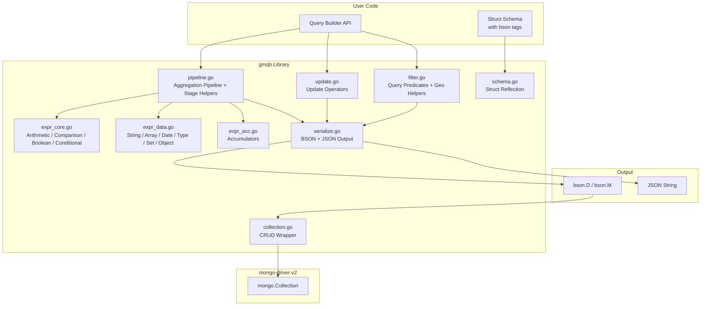

# gmqb Design Document

## Architecture Overview



## Package Structure

```
gmqb/
├── README.md
├── DESIGN.md
├── go.mod / go.sum
│
├── schema.go              # Struct tag reflection, field name resolution
├── filter.go              # Query predicates + geospatial geometry helpers
├── update.go              # Update operator builder
├── pipeline.go            # Aggregation pipeline stages + stage helpers
├── expr_core.go           # Arithmetic, comparison, boolean, conditional expressions
├── expr_data.go           # String, array, date, type, set, object expressions
├── expr_acc.go            # Accumulator operators ($sum, $avg, $first, $top, etc.)
├── collection.go          # Generic CRUD wrapper over mongo.Collection
├── serialize.go           # BSON/JSON serialization helpers
├── options.go             # FindOptions, UpdateOptions wrappers
├── errors.go              # Custom error types
│
├── *_test.go              # Unit tests + testable examples
├── integration_test.go    # Integration tests (memongo)
│
└── examples/
    ├── 01_basic_find/         # Comparison operators
    ├── 02_complex_filter/     # Logical, regex, element operators
    ├── 03_geospatial/         # Point, Near
    ├── 04_array_queries/      # ElemMatch, Size
    ├── 05_update_fields/      # Set, Inc, Unset, CurrentDateAsTimestamp
    ├── 06_update_arrays/      # AddToSet, PushWithOpts
    ├── 07_aggregation_basic/  # GroupSpec, AccSum, AccAvg
    ├── 08_aggregation_lookup/ # LookupOpts, Unwind
    ├── 09_aggregation_facet/  # Facet with sub-pipelines
    ├── 10_aggregation_window/ # SetWindowFieldsSpec
    ├── 11_expressions/        # ExprCond, ExprMultiply, AddFieldsSpec
    ├── 12_crud_generics/      # Typed Collection[T]
    └── 13_json_output/        # JSON serialization
```

## Design Philosophy

### Immutability

Every builder method returns a **new instance**. The original is never mutated. This guarantees:

- **Thread safety** — concurrent goroutines can share builders without locks
- **No accidental mutation** — chaining always produces independent results
- **Composability** — base filters can be reused in multiple compositions

```go
base := gmqb.Eq("status", "active")
adminFilter := gmqb.And(base, gmqb.Eq("role", "admin"))   // base unchanged
userFilter := gmqb.And(base, gmqb.Eq("role", "user"))     // base unchanged
```

### Dual Filter API

Filters support two complementary styles:

- **Standalone constructors** (`gmqb.Eq(...)`) — because query predicates are naturally compositional values
- **Chainable methods** (`gmqb.NewFilter().Eq(...).Gte(...)`) — for building multi-condition filters fluently

Both produce the same `Filter` type and can be composed freely.

### Pipeline Stage Helpers

Complex aggregation stages use dedicated helper functions to eliminate raw `bson.D` construction:

```go
// Instead of raw bson.D:
bson.D{{"_id", bson.D{{"country", "$country"}}}, {"total", bson.D{{"$sum", 1}}}}

// Use helpers:
gmqb.GroupSpec(gmqb.GroupID("$country"), gmqb.GroupAcc("total", gmqb.AccSum(1)))
```

Available helpers: `GroupSpec`, `GroupAcc`, `GroupID`, `AddField`, `AddFieldsSpec`, `FillSpec`, `FillOutput`, `FillMethod`, `FillValue`, `DensifySpec`, `DensifyRange`, `SetWindowFieldsSpec`, `WindowOutput`, `Window`.

### Geometry Helpers

GeoJSON geometry construction is simplified with dedicated helpers:

```go
// Instead of:
bson.D{{"type", "Point"}, {"coordinates", bson.A{-73.9, 40.7}}}

// Use:
gmqb.Point(-73.9, 40.7)
gmqb.LineString([2]float64{0, 0}, [2]float64{1, 1})
gmqb.Polygon([][2]float64{{0, 0}, {3, 6}, {6, 1}, {0, 0}})
```

### Fail-Fast Errors

`Field[T]()` **panics** on invalid field paths rather than returning errors. Rationale:
- Field resolution is a programming error (typo), not a runtime condition
- Panics at startup are more informative than silent wrong queries at runtime
- This matches the convention of `regexp.MustCompile`, `template.Must`, etc.

## Core Types

| Type | Role | Pattern |
|------|------|---------|
| `Filter` | Query predicates | Value type wrapping `bson.D`. Standalone constructors and chainable methods. |
| `Updater` | Update documents | Value type with immutable method chaining (copy-on-write). |
| `Pipeline` | Aggregation pipelines | Value type with immutable method chaining (copy-on-write). |
| `Collection[T]` | Typed CRUD operations | Pointer type wrapping `*mongo.Collection`. |

### Output Methods (Serializable)

All builders expose:

- `BsonD() bson.D` — for the mongo-driver
- `JSON() string` — pretty-printed, for debugging
- `CompactJSON() string` — compact, for logging

## Builder Pattern — Copy-on-Write

Internally, `Updater.addOp()` and `Pipeline.addStage()` copy the existing slice before appending:

```go
func (u Updater) addOp(op, field string, value interface{}) Updater {
    newOps := make(bson.D, len(u.ops))
    copy(newOps, u.ops)
    // ... merge or append ...
    return Updater{ops: newOps}
}
```

This ensures the original builder is never modified.

## Schema Reflection

`Field[T](path)` resolves Go struct field paths to BSON field names:

1. Inspect `bson:"name"` struct tag
2. Fall back to lowercased field name if no tag
3. Recurse into nested/embedded structs (e.g., `"Address.City"` → `"address.city"`)
4. Skip `time.Time` and mongo-driver types from recursion
5. Cache results per type in `sync.Map` (one-time cost per struct type)

## Serialization Pipeline

```
Builder.BsonD() → bson.D → mongo-driver (Find, Update, Aggregate)
Builder.JSON()  → bson.D → bson.MarshalExtJSON → json.Indent → string
```

Uses `bson.MarshalExtJSON(d, false, false)` for canonical Extended JSON without special type wrappers.

## Generics Strategy

- `Collection[T]` — binds the document type for CRUD. `Find` returns `[]T`, `FindOne`, `FindOneAndUpdate`, etc. return `*T`.
- `BulkWrite` — takes `WriteModel[T]` typed interfaces.
- `Aggregate[R, T]` — separate result type `R` for pipelines that reshape documents.

## Extensibility

- `Raw(bson.D)` — escape hatch for unsupported query operators
- `Pipeline.RawStage(name, value)` — add any custom/Atlas-specific stage
- `Unwrap()` — access the underlying `*mongo.Collection` directly

## Operator Coverage

### Query Predicates (30 operators + 3 geometry helpers)

| Category | Operators |
|----------|-----------|
| Comparison | `Eq`, `Ne`, `Gt`, `Gte`, `Lt`, `Lte`, `In`, `Nin` |
| Logical | `And`, `Or`, `Nor`, `Not` |
| Element | `Exists`, `Type` |
| Evaluation | `Mod`, `Regex`, `Expr`, `Where`, `JsonSchema` |
| Array | `All`, `ElemMatch`, `Size` |
| Geospatial | `GeoIntersects`, `GeoWithin`, `Near`, `NearSphere` |
| Geo Helpers | `Point`, `LineString`, `Polygon` |
| Bitwise | `BitsAllClear`, `BitsAllSet`, `BitsAnyClear`, `BitsAnySet` |

### Update Operators (21 operators)

| Category | Operators |
|----------|-----------|
| Field | `Set`, `Unset`, `Inc`, `Mul`, `Min`, `Max`, `Rename`, `CurrentDate`, `CurrentDateAsTimestamp`, `SetOnInsert` |
| Array | `AddToSet`, `AddToSetEach`, `Pop`, `Pull`, `PullAll`, `Push`, `PushWithOpts` |
| Bitwise | `BitAnd`, `BitOr`, `BitXor` |

### Aggregation Stages (30+ stages)

| Category | Stages |
|----------|--------|
| Core | `Match`, `MatchRaw`, `Project`, `Group`, `Sort`, `Limit`, `Skip`, `Unwind`, `UnwindWithOpts` |
| Joins | `Lookup`, `LookupPipeline`, `GraphLookup` |
| Reshape | `AddFields`, `SetFields`, `Unset`, `ReplaceRoot`, `ReplaceWith`, `Redact` |
| Analysis | `Bucket`, `BucketAuto`, `Facet`, `Count`, `SortByCount`, `Sample` |
| Output | `Out`, `OutToDb`, `Merge` |
| Geo | `GeoNear` |
| Window | `SetWindowFields` |
| Other | `UnionWith`, `Fill`, `Densify`, `RawStage` |

### Stage Helpers (17 helpers)

| Helper | Purpose |
|--------|---------|
| `GroupSpec`, `GroupAcc`, `GroupID` | Build `$group` specs |
| `Asc`, `Desc`, `SortSpec`, `SortRule` | Build sort documents |
| `AddField`, `AddFieldsSpec` | Build `$addFields` / `$set` specs |
| `FillSpec`, `FillOutput`, `FillMethod`, `FillValue` | Build `$fill` specs |
| `DensifySpec`, `DensifyRange` | Build `$densify` specs |
| `SetWindowFieldsSpec`, `WindowOutput`, `Window` | Build `$setWindowFields` specs |

### Expression Operators (~120 operators)

| File | Categories |
|------|------------|
| `expr_core.go` | Arithmetic, comparison, boolean, conditional |
| `expr_data.go` | String, array, date, type conversion, set, object, literal, miscellaneous |
| `expr_acc.go` | Accumulators (`AccSum`, `AccAvg`, `AccMin`, `AccMax`, `AccFirst`, `AccLast`, `AccPush`, `AccAddToSet`, `AccCount`, `AccTop`, `AccBottom`, `AccMedian`, `AccPercentile`, etc.) |
